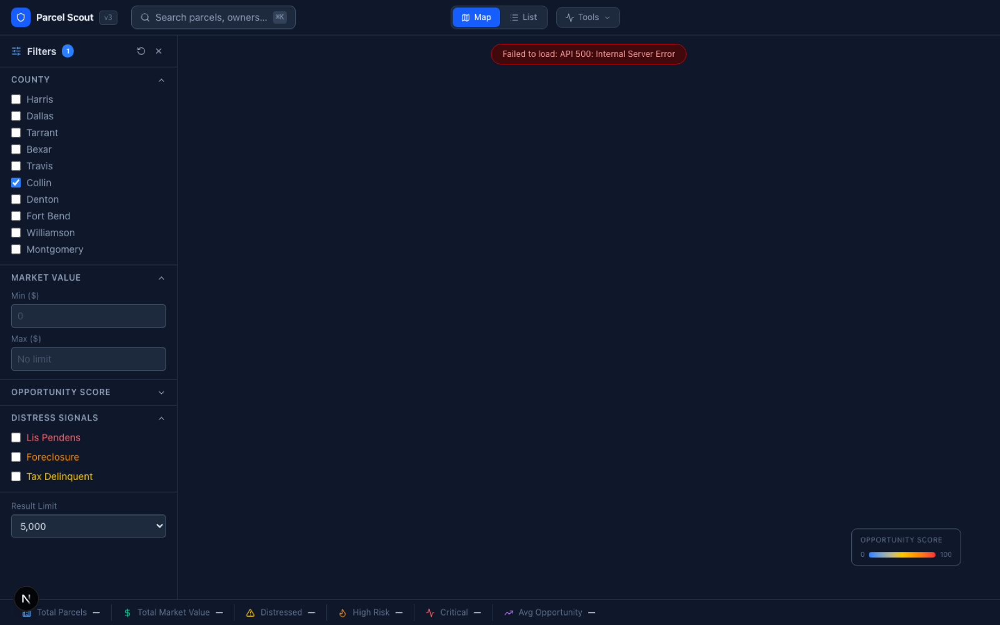
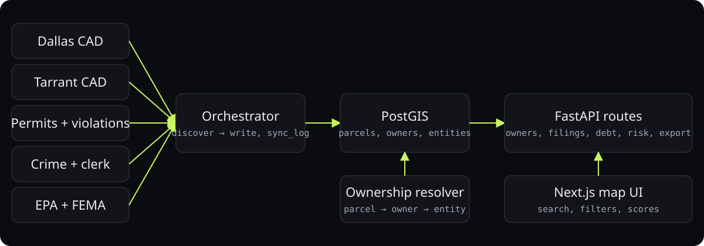

<div align="center">



# Parcel Scout v3

**Property research agent for North Texas: eight source connectors, four county clerk scrapers, ownership resolution, and a map-first UI.**

<p>
<a href="https://ibiraheel.com/p/parcel-scout"></a>
</p>

<p>


</p>

</div>

<br>

> **8 data sources, 4 counties, one ownership graph**  
> for Equitify, sourcing off-market parcels in Dallas, Tarrant, Collin, and Denton

## What it did

An orchestrator runs appraisal-district, permit, violation, crime, clerk, EPA, and FEMA connectors into PostGIS, resolves owners into entities, and scores opportunity and risk. Address-search pipelines completed for all four counties.

<sub>Outcome: measured.</sub>

## How it works

<p align="center"></p>

1. Every source is a SourceConnector subclass with discover and write phases, so dry runs are free.
2. Sync log table records every run, so a bad scrape is visible and reversible.
3. Ownership resolver links parcels to owners to entities across sources, which is where the value is.
4. PostGIS and Redis in docker-compose; FastAPI routes per domain (owners, filings, debt, risk, export).

## Run it locally

```bash
docker compose up -d                       # PostGIS + Redis
pip install -r backend/requirements.txt
uvicorn backend.main:app --reload          # API on :8000 (run from the repo root)
cd frontend && npm install && npm run dev  # map UI on :3000
```

`DATABASE_URL` defaults to the compose database; set it to point anywhere else.

## Repository layout

```
├── backend/
│   ├── connectors/
│   ├── models/
│   ├── routes/
│   ├── services/
│   ├── __init__.py
│   ├── config.py
│   ├── database.py
│   ├── main.py
│   ├── orchestrator.py
│   └── requirements.txt
├── db/
│   └── init/
├── frontend/
│   ├── public/
│   ├── src/
│   ├── AGENTS.md
│   ├── CLAUDE.md
│   ├── eslint.config.mjs
│   ├── next-env.d.ts
│   ├── next.config.ts
│   ├── package.json
│   ├── postcss.config.mjs
│   ├── README.md
│   ├── tsconfig.json
│   └── tsconfig.tsbuildinfo
├── scrapers/
│   ├── __init__.py
│   ├── collin_address_search_progress.json
│   ├── collin_clerk.py
│   ├── collin_ownership_pipeline.py
│   ├── dallas_address_search_progress.json
│   ├── dallas_clerk.py
│   ├── denton_address_search_progress.json
│   ├── denton_clerk.py
│   ├── tarrant_address_search_progress.json
│   └── tarrant_clerk.py
├── scripts/
│   ├── migrate_duckdb_to_postgres.py
│   └── migrate_events.py
└── docker-compose.yml
```

---

<div align="center">

<sub>Built by <a href="https://github.com/ibi-raheel">Muhammad Ibrahim Raheel</a> · more work at <a href="https://ibiraheel.com">ibiraheel.com</a></sub>

</div>
